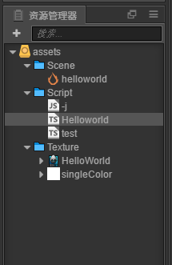
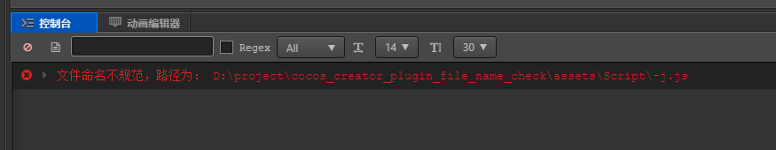
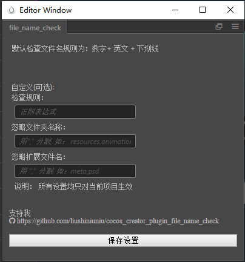
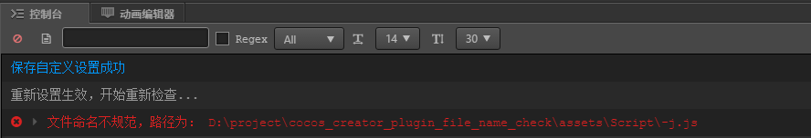

# cocos_creator 文件名规范检查插件
cocos creator 插件： 文件名格式检查

- 使用说明
> - 在插件商店中安装， 建议都安装在当前项目中。 各项目可能有不同设置
> - 点击 插件 > 文件名自动检查 > 开始检查。 使用现有设置进行检查，没有设置则使用默认的设置（以英文，数字，下划线的组合命名） 
> - 点击 插件 > 文件名自动检查 > 自定义设置。 弹出面板， 可自定义 检查规则，忽略的文件夹 以及 文件类型。 该设置只对当前项目生效

- 问题反馈
由于时间精力有限，只测试了1.9.3 版本 和2.1.2 版本。 运行正常， 原理上其他版本也应该能用， 若是有问题，欢迎提issues

- 示例使用图片
-

